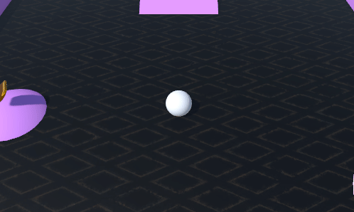
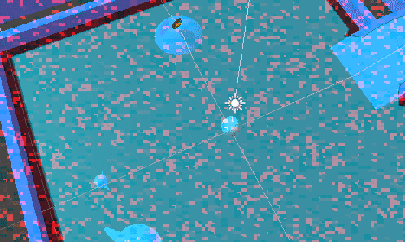

# Roll a Ball Game - Unity 🏐

Este proyecto es una versión personalizada del tutorial de "Roll a Ball" de Unity. He seguido el curso completo de "Roll a Ball" para crear este juego y agregarle mis propios toques y características adicionales.

## Características 📜

- **Superficies y Obstáculos**: El juego cuenta con tres superficies diferentes, cada una con obstáculos que dificultan el movimiento. Todo el entorno está diseñado en tonos de rosa para dar un estilo único al juego.
  
- **Recogida de Monedas**: He añadido monedas por todo el mapa. El jugador debe recoger un número específico de monedas para ganar. El marcador de puntos en la interfaz indica cuántas monedas se han recogido hasta el momento.
  
- **Enemigo (Fantasma Rosa)**: Un enemigo en forma de fantasma rosa persigue al jugador. Si el fantasma toca al jugador, se muestra un mensaje en pantalla indicando que se ha perdido la partida.
    
## Materiales Utilizados 🎨

- Los **modelos y texturas** del entorno, así como el modelo del **fantasma rosa**, fueron descargados desde la **Asset Store de Unity**.
  
- Se utilizaron **texturas personalizadas** para las superficies y los obstáculos, las cuales se diseñaron con un estilo de color rosa.

## Scripts ⚙️
### FirstPersonCamera.cs
Este código implementa una cámara en primera persona y el movimiento:

- **Cámara**: Sigue al jugador con un desplazamiento (offset), rota en función del movimiento del ratón. La rotación vertical está limitada entre -90 y 90 grados para evitar giros excesivos.
- **Movimiento del jugador**: Controlado por las teclas de dirección (*W A S D*), el movimiento se ajusta según la rotación de la cámara. Se aplica al Rigidbody del jugador para interactuar con la física del mapa.

Métodos:

- **LateUpdate()**: Actualiza la rotación de la cámara y la posición relativa al jugador.
- **FixedUpdate()**: Aplica el movimiento del jugador en base a la entrada del teclado y la rotación de la cámara.

### ThirdPersonController.cs
Este código implementa una cámara en tercera persona que sigue al jugador:

- **Cámara**: Mantiene una distancia constante del jugador usando un desplazamiento (offset).

Métodos:

- **Start()**: Calcula el desplazamiento inicial entre la cámara y el jugador al inicio del juego.
- **LateUpdate()**: Actualiza la posición de la cámara para que siga al jugador, manteniendo el mismo desplazamiento.
