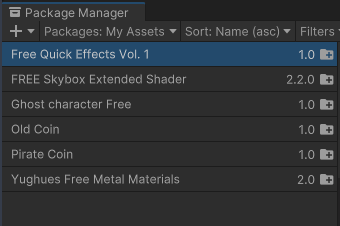
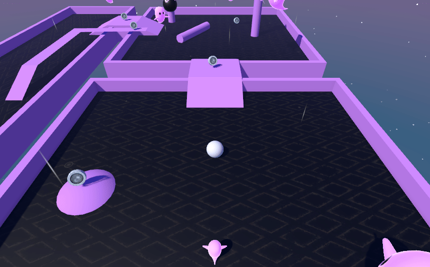
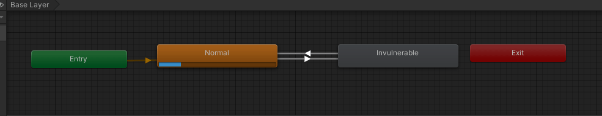
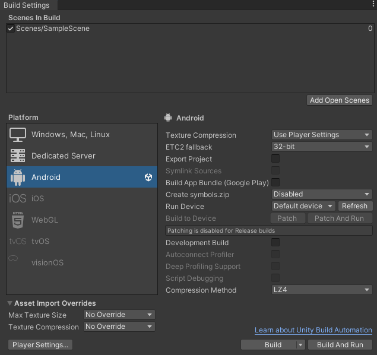
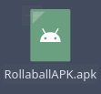

# Roll a Ball Game - Unity 🏐
#### 👤 Autor: Pablo Iglesias Leyenda

Este proyecto es una versión personalizada del tutorial de **"Roll a Ball"** de Unity.
He seguido el curso completo de "Roll a Ball" para crear este juego y agregarle mis propios toques y características adicionales.

<details>
<summary> <b> Características 📜 </b> </summary>

- **Superficies y Obstáculos**: El juego cuenta con tres superficies diferentes, cada una con obstáculos que dificultan el movimiento. Todo el entorno está diseñado en tonos de rosa para dar un estilo único al juego. También cuenta con un plano invisible bajo el mapa para detectar cuando el jugador se cae y el juego debe terminar.

  

- **Recogida de Monedas**: He añadido monedas por todo el mapa. El jugador debe recoger un número específico de monedas para ganar. El marcador de puntos en la interfaz indica cuántas monedas se han recogido hasta el momento.

  

- **Enemigo (Fantasma Rosa)**: Un enemigo en forma de fantasma rosa persigue al jugador. Si el fantasma toca al jugador, se muestra un mensaje en pantalla indicando que se ha perdido la partida.

  

- He creado un script (*RampTrigger*) que genera un **impulso** cuando el jugador pasa por encima de una rampa. Esto permite al jugador saltar y superar obstáculos.

  

- He modificado el script (*PlayerController.cs*) para que el jugador pueda hacer un **salto hacia arriba**, añadiendo así más variedad en los movimientos del juego.

  

- He añadido también efectos visuales por todo el mapa (**lluvia, rayos y fuego**) para hacer que el escenario sea más llamativo y divertido. También he actualizado el cielo y las texturas de las monedas.

  

</details>


<details>
<summary> <b> Materiales Utilizados 🎨 </b> </summary>

- Los **modelos y texturas** del entorno, así como el modelo del **fantasma rosa**, fueron descargados desde la **Asset Store de Unity**.

  

- Se utilizaron **texturas personalizadas** para las superficies y los obstáculos, las cuales se diseñaron con un estilo de color rosa. *Se ven las texturas bug por un error en Unity*

  

- A medida que he ido avanzando con el juego, he ido utilizando más assets, como por ejemplo para las texturas de las **monedas, el cielo, los efectos del mapa**, etc.

  

</details>

<details>
<summary> <b> Scripts ⚙️ </b> </summary>

## Cámaras
### FirstPersonCamera.cs
Este código implementa una cámara en primera persona y el movimiento:

- **Cámara**: Sigue al jugador con un desplazamiento (offset), rota en función del movimiento del ratón. La rotación vertical está limitada entre -90 y 90 grados para evitar giros excesivos.
- **Movimiento del jugador**: Controlado por las teclas de dirección (*W A S D*), el movimiento se ajusta según la rotación de la cámara. Se aplica al Rigidbody del jugador para interactuar con la física del mapa.

Métodos:

- **LateUpdate()**: Actualiza la rotación de la cámara y la posición relativa al jugador.
- **FixedUpdate()**: Aplica el movimiento del jugador en base a la entrada del teclado y la rotación de la cámara.


### ThirdPersonController.cs
Este código implementa una cámara en tercera persona que sigue al jugador:

- **Cámara**: Mantiene una distancia constante del jugador usando un desplazamiento (offset).

Métodos:

- **Start()**: Calcula el desplazamiento inicial entre la cámara y el jugador al inicio del juego.
- **LateUpdate()**: Actualiza la posición de la cámara para que siga al jugador, manteniendo el mismo desplazamiento.



</details>

<details>
<summary> <b> Estados 🔧 </b> </summary>

### Invulnerabilidad
He añadido un estado de **invulnerabilidad** al jugador que se activa cuando el jugador recoge una moneda. Durante este estado, el jugador es inmune y no puede ser tocado por el fantasma. El estado de invulnerabilidad dura 1 segundo por defecto (aunque se puede modificar) y se indica con un efecto visual de destello y cambio de color.

Para hacer este estado he modificado ***PlayerCOntroller.cs*** para añadir el efecto de invulnerabilidad.

También he añadido un Animator Controller que cambia cada vez que paso sobre una moneda:



Este se encarga de gestionar cuando el jugador coge una moneda y pasa al estado de invulnerabilidad. Y también controla cuando dicho estado se acaba y debe volver al estado normal.


</details>

<details>
<summary> <b> Creación de la APK 📱 </b> </summary>

#### Preparar el Proyecto en Unity para Android

Desde **'Installs'** en Unity Hub selecciono la versión de Unity que
estoy usando e instalo los módulos de Android Build Support, SDK & NDK Tools, y OpenJDK.

#### Configurar el Proyecto para Android
Abro Unity y voy al apartado de Build Settings, ahí selecciono Android,
hago click en Switch Platform y espero a que Unity convierta el proyecto a Android.



### Ajustar la Configuración del Proyecto
   
En el apartado de Player en Project Settings, he entrado en la pestaña de Android y he configurado los siguientes puntos:
   - Company Name y Product Name (nombre o identificador de la app).
   - Package Name (com.pabloiglesias.rollaball).
   - Minimum API Level: Android 6.0 (API 23) o superior.
   - Target API Level: Automatic (Highest Installed).
   - Cambio en la rotación de la pantalla obligatoria.

### Modificar el código para que los controles funcionen en el teléfono
Modifico el código de PlayerController y añado las siguientes líneas:

```c#
private void FixedUpdate() {
    Vector3 dir = Vector3.zero;
    dir.x = -Input.acceleration.y;
    dir.z = Input.acceleration.x;
    if (dir.sqrMagnitude > 1)
        dir.Normalize();
    
    dir *= Time.deltaTime;
    transform.Translate(dir * speed);
}
```

Esto hará que el juego funcione correctamente en el teléfono.
### Generar la APK

Desde la escena principal voy a Build Settingsy compruebo que la escena principal está en la lista de Scenes In Build.
Una vez comprobado hago click en Build. Selecciono una carpeta donde guardar la APK y espero a que Unity termine de compilar.



### Probar la APK en un Dispositivo Android
Para instalar la APK en el teléfono y poder probarla he seguido los siguientes pasos:

1. Habilitar la Depuración USB en el Dispositivo.
2. Activar las Opciones de Desarrollador.
3. Conectar el móvil al ordenador con un cable USB.
4. Copiar la APK generada en el dispositivo.

### Crear Release en GitHub
Una vez acabada la APK y comprobado su correcto funcionamiento, la subo a GitHub y creo un Release siguiendo los siguientes pasos:

1. Click en **'Releases'** y después en **'Draft a new release'**.
2. Completo los detalles necesarios (versión, nombre, descripción).
3. Arrastro la APK al área de Attach binaries.
4. Finalmente publico la release.

</details>